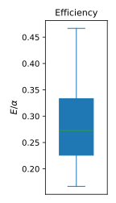

# Via Data Challenge
### Author: Caleb C. Reagor, Ph.D.
### Date: September 26th, 2025

<br>

```
1. Propose a metric and/or algorithm to assess the potential efficiency of aggregating rides from many vehicles into one microtransit van/bus, given the available data. Make realistic assumptions and any necessary simplifications and state them.
```
### To assess the aggregation of rides into vans, I implemented an iterative density-based clustering algorithm and a complementary efficiency metric derived directly from the inferred clusters

### Clustering Approach:

- Algorithm — HDBSCAN (hierarchical density-based clustering with noise)
- Input Features — pickup locations ($x_0, y_0$) and times ($t_0$) & dropoff locations ($x_1, y_1$)
- Outputs — cluster labels $k$ for trips and passengers
- Implementation Notes:
    - Clustering is performed on individual passengers via duplication of trips with multiple passengers

    - The `time_scale` parameter is used to scale time (in minutes) relative to distances (in miles)
        - $\downarrow$ `time_scale` (*e.g.*, <10 min/mile) $\rightarrow$ tight temporal clusters + weak spatial clusters
        - $\uparrow$ `time_scale` (*e.g.*, >60 min/mile) $\rightarrow$ tight spatial clusters + weak temporal clusters
        - Best `time_scale` ($\approx$ 20-30 min/mile) $\rightarrow$ spatiotemporal coherence (spread $\approx$ 5 min, 0.2 miles)

    - Clustering is performed in non-overlapping time windows $\leq$ 24 hours to balance complexity and splitting

    - The final implementation performs iterative clustering while relaxing the `min_cluster_size` constraint
        - `min_cluster_size` $=6$ initially (*i.e.*, typical van size) and decreases sequentially like $\set{6,5,4,3,2}$

- See [`01_clustering.ipynb`](notebooks/01_clustering.ipynb) and [`cluster.py`](utils/cluster.py) for the full scripts, analysis and results

### Efficiency Metric

- I define the efficiency $E$ of taxi rider/vehicle configurations for a given cluster $k$ as the cost per capita vs. best-case aggregation:

    - $E = \frac{c_v}{c} = \frac{\text{cost per capita aggregated}}{\text{cost per capita actual}} \in (0,1]$ (ideal case)

    - $E = 1 \rightarrow$ observed taxi rider/vehicle configuration is as efficient as pooling

    - $E < 1 \rightarrow$ taxi rider/vehicle configuration is inefficient vs. pooling

- Assuming that van trips cost a scalar multiple $\alpha$ of the average taxi trip cost, the efficiency $\approx$ relative packing:

    - $E = \alpha \cdot \frac{M_v}{M} \rightarrow \frac{E}{\alpha} = \frac{M_v}{M}$ (unitless), where $M =$ total number of taxi trips and $M_v =$ total number of van trips

        - The number of van trips $M_v$ depends on the number of passengers in cluster $k$ and van capacity (*e.g.*, 6)

- Additional assumptions, simplifications, advantages & disadvantages:

    - Assumptions:

        - Clusters $k$ represent the true optimal groupings for a set of trips and passengers

        - The total cost for a given rider/vehicle configuration is split evenly between the passengers

        - The scaling between taxi and van costs is approximately scalar (represented by parameter $\alpha$)

    - Simplifications:

        - We only care about the efficiency of the actual trips and discount any dead time spent between trips

        - We only care about clusters of $\geq 2$ passengers and ignore outliers/noise from HDBSCAN clustering

        - Efficiency only depends on rider demand and disregards any supply-side limitations (*e.g.*, fleet size)

    - Advantages:

        - $\frac{E}{\alpha} = \frac{M_v}{M}$ is a scale-free metric that can meaningfully compare between long and short trips

        - $M_v$ is directly tunable and can optimize the van/bus capacity across different regions/times

    - Disadvantages:

        - $\frac{E}{\alpha}$ depends strongly on urban density and cannot accurately compare between dense/sparse regions

        - Packing efficiency can only assess aggregation/configuration and is agnostic of trip distance and duration 

- See [`02_efficiency.ipynb`](notebooks/02_efficiency.ipynb) for the complete results and analysis

<br>

```
2. Implement your proposed method and evaluate Manhattan’s overall efficiency using yellow taxi data from the first full week (Monday-Sunday) in June 2013. Discuss how your method would scale with more data; in other words, discuss the complexity of your implementation.
```

### Overall Efficiency (Manhattan)



### Complexity (time/space)

- HDBSCAN time $= N \log N$, where $N =$ number of passengers in time window

- Number of time windows $= T$

- Tuning time $\approx O(H$ $T$ $N \log N)$, where $H =$ number of `time_scale` values

- Final inference time $\approx O(G$ $T$ $N \log N)$, where $G =$ number of `min_cluster_size` values

- Space complexity $\approx O(N)$

<br>

```
3. Based on your implementation in the previous question, use visualizations to show how efficiency varies with time and location. Discuss any potential business implications based on your findings.
```
